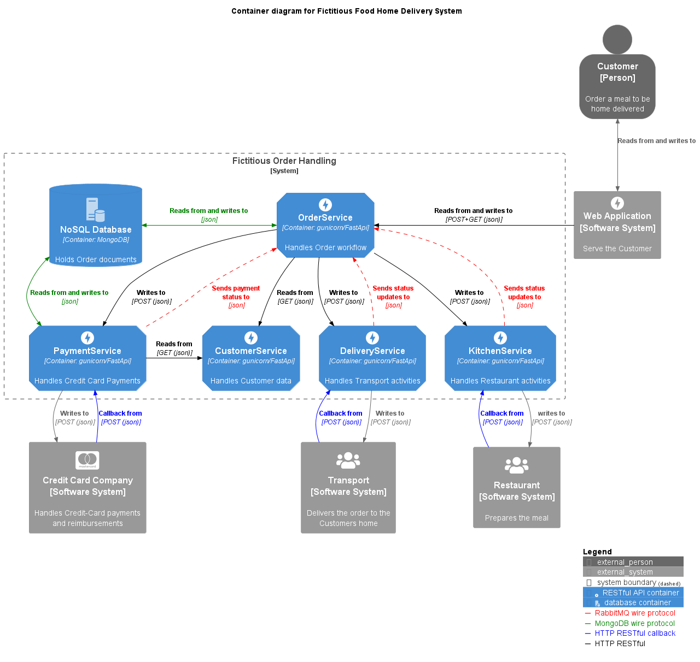

# Food Delivery System - Microservices

This repository contains the source code for a microservices-based food delivery system. The system is composed of several independent services that work together to provide a complete food ordering and delivery experience.

## Services

The food delivery system consists of the following microservices:

1. **Order Service**: Handles the creation, management, and tracking of food orders.
2. **Payment Service**: Processes payments for the placed orders.
3. **Kitchen Service**: Manages the preparation of food orders in the kitchen.
4. **Delivery Service**: Coordinates the delivery of completed orders to customers.

Each service is designed to be self-contained, scalable, and easily maintainable. They communicate with each other using a messaging system or RESTful APIs.

## Architecture

The food delivery system follows a microservices architecture, which provides several benefits:

- **Scalability**: Each service can be scaled independently based on its specific resource requirements.
- **Flexibility**: New services can be added or existing services can be modified without affecting the entire system.
- **Fault Tolerance**: If one service fails, the others can continue to operate, ensuring the overall system's reliability.
- **Technology Diversity**: Different services can be implemented using the most appropriate technologies for their specific requirements.

The overall architecture of the system is depicted in the following diagram:

```html
<div style="text-align:center">
  
</div>
